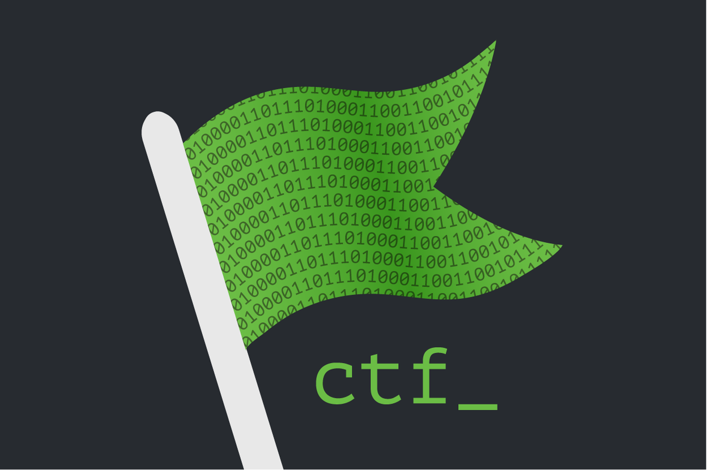

# Capture The Flag



# WeChall


## Using WeChall Scoreboard to keep track of progress

1. First, go to [WeChall](https://www.wechall.net/) and register for an account.
2. Next, log in and retrieve your WeChall token and username. Your WeChall username is what you registered with, while your WeChall token can be found on the WeChall website under [“Account” -&gt; “WarBoxes”](https://www.wechall.net/warboxes). The token looks something like “EDD76-1FC9F-7388B-DC6EB-E3F71-FC4CB”.
3. Next, assuming you are using the correct operating system, edit your ~/.bashrc file and add:

   ```text
   export WECHALLUSER="YourUserName"
   export WECHALLTOKEN="YOUR-WECHALL-TOKEN-HERE"
   ```

   \*If you are using Windows 10 \(WSL\), you can either use the Ubuntu terminal which automatically loads the bashrc file or the file can be found in _C:\Users\USERNAME\AppData\Local\Packages{LINUX\_DISTRIBUTION}\LocalState\rootfs\home{LINUXUSER}\_

For `fish` users, you may run:

```text
set -Ux WECHALLUSER "YourUserName"
```

You may need to logout and login again for these changes to take effect. To test whether the environment variables are registered, type “echo $WECHALLUSER”, which should show that environment variable.

1. Next, edit ~/.ssh/config \(or create it if it doesn’t exist\) and add:

   ```text
   Host *.labs.overthewire.org
     SendEnv WECHALLTOKEN
     SendEnv WECHALLUSER
   ```

   This configures your SSH client to transmit both username and token to your remote session, so it can be used there.

2. Finally, you are able to easily register which levels you have beaten on OverTheWire by logging in through SSH the normal way, and invoking the “wechall” command. This command will use your WeChall username and WeChall token to register the level you have beaten with WeChall. `WECHALLUSER="tokumeipoh" WECHALLTOKEN="129CF-40592-FCDCF-67470-6F4EA-D5DB1" wechall`


