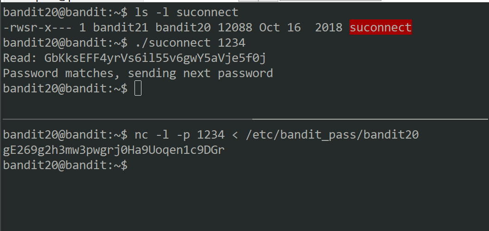
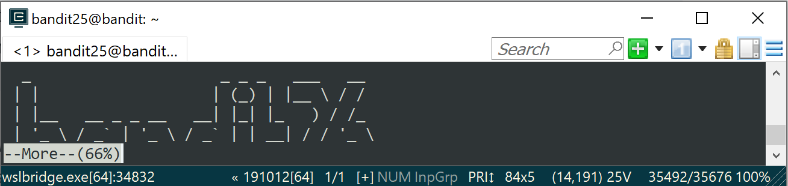
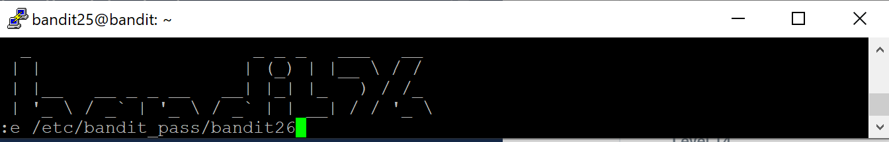

# Bandit

The Bandit wargame is aimed at absolute beginners. It will teach the basics needed to be able to play other wargames. **If you notice something essential is missing or have ideas for new levels, please let us know!**

### Note for beginners <a id="note-for-beginners"></a>

This game, like most other games, is organised in levels. You start at Level 0 and try to “beat” or “finish” it. Finishing a level results in information on how to start the next level. The pages on this website for “Level &lt;X&gt;” contain information on how to start level X from the previous level. E.g. The page for [Level 1](https://overthewire.org/wargames/bandit/bandit1.html) has information on how to gain access from [Level 0](https://overthewire.org/wargames/bandit/bandit0.html) to [Level 1](https://overthewire.org/wargames/bandit/bandit1.html). All levels in this game have a page on this website, and they are all linked to from the sidemenu on the left of this page.

You will encounter many situations in which you have no idea what you are supposed to do. **Don’t panic! Don’t give up!** The purpose of this game is for you to learn the basics. Part of learning the basics, is reading a lot of new information.

There are several things you can try when you are unsure how to continue:

* First, if you know a command, but don’t know how to use it, try the **manual** \([man page](https://en.wikipedia.org/wiki/Man_page)\) by entering “**man &lt;command&gt;**” \(without the quotes\). e.g. if you know about the “ls” command, type: man ls. The “man” command also has a manual, try it. Press q to quit the man command.
* Second, if there is no man page, the command might be a **shell built-in**. In that case use the “**help &lt;X&gt;**” command. E.g. help cd
* Also, your favorite **search-engine** is your friend. Learn how to use it! I recommend [Google](https://www.google.com/).
* Lastly, if you are still stuck, you can [join us on IRC](https://overthewire.org/information/irc.html)

You’re ready to start! Begin with [Level 0](https://overthewire.org/wargames/bandit/bandit0.html), linked at the left of this page. Good luck!

**Note for VMs:** You may fail to connect to overthewire.org via SSH with a “_broken pipe error_” when the network adapter for the VM is configured to use NAT mode. Adding the setting **`IPQoS throughput`** to `/etc/ssh/ssh_config` should resolve the issue. If this does not solve your issue, the only option then is to change the adapter to Bridged mode.

### Level 0

> The goal of this level is for you to log into the game using SSH. The host to which you need to connect is **bandit.labs.overthewire.org**, on port 2220. The username is **bandit0** and the password is **bandit0**. Once logged in, go to the [Level 1](https://overthewire.org/wargames/bandit/bandit1.html) page to find out how to beat Level 1.

If you get an ssh error "Bad owner or permissions on /home/{user}/.ssh/config", you need to set rw permission only for the user

```bash
chmod 600 ~/.ssh/config
// or
chown $USER ~/.ssh/config
```

> The password for the next level is stored in a file called **readme** located in the home directory. Use this password to log into bandit1 using SSH. Whenever you find a password for a level, use SSH \(on port 2220\) to log into that level and continue the game.

Use cat command to read the file and get the password. Then use that password to login to the same server with incrementing bandit number as the username. E.g.  
_`sudo bandit1@bandit.labs.overthewire.org -p 2220`_

### _Level 1_

> The password for the next level is stored in a file called **-** located in the home directory
>
> Helpful Reading Material  
> [Google Search for “dashed filename”](https://www.google.com/search?q=dashed+filename)  
> [Advanced Bash-scripting Guide - Chapter 3 - Special Characters](http://tldp.org/LDP/abs/html/special-chars.html)

In order for cat to consider the dash a filename instead of STDIN/STDOUT, you have to specify path such as \(if in same directory\)

```bash
cat ./-
```

### Level 2

> The password for the next level is stored in a file called **spaces in this filename** located in the home directory
>
> Helpful Reading Material
>
> * [Google Search for “spaces in filename”](https://www.google.com/search?q=spaces+in+filename)

Either access the whole filename inside double quotes or escape each space with a back slash

```bash
cat "spaces in this filename"
# or
cat spaces\ in\ this\ filename
```

### Level 3

> The password for the next level is stored in a hidden file in the **inhere** directory.

Hidden files usually has a period in front of their names. To list hidden files, pass the option -al. Once you know the name of the hidden file, you can cat the filename.

```bash
ls -al            #to list all files including hidden ones
cat ./.hidden     # file called ".hidden" was found
```

### Level 4

> The password for the next level is stored in the only human-readable file in the **inhere** directory. Tip: if your terminal is messed up, try the “reset” command.

cd into the inhere directory and cat all files, one at a time, until you see the password. Or cat all files with the name starting with "-file\*". Or **in main directory** type

```bash
# find in current directory type=file, 
# | print file types | look for text type

bandit4@bandit:~/inhere$ find -type f | xargs file | grep text
./-file07: ASCII text
bandit4@bandit:~/inhere$ cat ./-file07
```

### Level 5

> The password for the next level is stored in a file somewhere under the **inhere** directory and has all of the following properties:
>
> * human-readable
> * 1033 bytes in size
> * not executable

```bash
find . -type f -size 1033c ! -executable | xargs cat
```

find in current directory type=file size=1033 bytes executable=not \| print arguments

### Level 6

> The password for the next level is stored **somewhere on the server** and has all of the following properties:
>
> * owned by user bandit7
> * owned by group bandit6
> * 33 bytes in size

```bash
cat `find / -size 33c -group bandit6 -user bandit7 2>/dev/null`
```

`find /` means find in root directory 

What `2>/dev/null` does is, it redirects all standard errors like `No such file or directory` and `Permission denied` to `/dev/null` where `null` acts as a special device which discards all information written to it. Thus we only get the one required file as output which I sent as input to `cat` to see its contents.

### Level 7

> The password for the next level is stored in the file **data.txt** next to the word **millionth**

```bash
grep "millionth" data.txt
```

### Level 8

> The password for the next level is stored in the file **data.txt** and is the only line of text that occurs only once

```bash
bandit8@bandit:~$ sort data.txt | uniq -u
# uniq -u prints out only unique lines
```

### Level 9

> The password for the next level is stored in the file **data.txt** in one of the few human-readable strings, beginning with several ‘=’ characters.

```bash
bandit9@bandit:~$ strings data.txt | grep "=="
# strings - print the sequences of printable characters in files
```

### Level 10

> The password for the next level is stored in the file **data.txt**, which contains base64 encoded data

```bash
bandit10@bandit:~$ base64 -d data.txt
# base64 encode/decode data and print to standard output
```

### Level 11

> The password for the next level is stored in the file **data.txt**, where all lowercase \(a-z\) and uppercase \(A-Z\) letters have been rotated by 13 positions

```bash
bandit11@bandit:~$ cat data.txt | tr 'A-Za-z' "N-ZA-Mn-za-m"
```

tr - translate or delete characters 

### Level 12

> The password for the next level is stored in the file **data.txt**, which is a hexdump of a file that has been repeatedly compressed. For this level it may be useful to create a directory under /tmp in which you can work using mkdir. For example: mkdir /tmp/myname123. Then copy the datafile using cp, and rename it using mv \(read the manpages!\)

xxd - make a hexdump or do the reverse.  
xxd -r\[evert\] \[options\] \[infile \[outfile\]\]  
 So the given file was a hexdump. I used `xxd -r <filename>` to reverse it and sent the output to a file. I kept using `file` command at each step to know what I’m tackling.  
`gzip` compressed files are extracted using `gunzip`. But `gunzip` extracts files only with certain extension, `.gz` being one of them. So extension was renamed.  
`bzip2` compressed files are extracted using `bzip2 -d <filename>` where `-d` flag stands for “decompress”.  
For `tar` archives I used `tar xvf <filename>`. 


tar options

 **-c :** Creates Archive  
**-x :** Extract the archive  
**-f :** creates archive with given filename  
**-t :** displays or lists files in archived file  
**-u :** archives and adds to an existing archive file  
**-v :** Displays Verbose Information  
**-A :** Concatenates the archive files  
**-z :** zip, tells tar command that create tar file using gzip  
**-j :** filter archive tar file using tbzip  
**-W :** Verify a archive file  
**-r :** update or add file or directory in already existed .tar file


Repeatedly decompressing files will result in an ASCII text file in the end

```bash
bandit12@bandit:~$ ls
data.txt
bandit12@bandit:~$ mkdir /tmp/poh && cp data.txt /tmp/poh/a.txt
bandit12@bandit:~$ cd /tmp/poh
bandit12@bandit:/tmp/poh$ ls
a.txt
bandit12@bandit:/tmp/poh$ file a.txt
a.txt: ASCII text
bandit12@bandit:/tmp/poh$ xxd -r a.txt b
bandit12@bandit:/tmp/poh$ file b
b: gzip compressed data, was "data2.bin", last modified: Tue Oct 16 12:00:23 2018, max compression, from Unix
bandit12@bandit:/tmp/poh$ mv b b.gz
bandit12@bandit:/tmp/poh$ gunzip b.gz
bandit12@bandit:/tmp/poh$ ls
a.txt  b
bandit12@bandit:/tmp/poh$ file b
b: bzip2 compressed data, block size = 900k
bandit12@bandit:/tmp/poh$ bzip2 -d b
bzip2: Cant guess original name for b -- using b.out
bandit12@bandit:/tmp/poh$ file b.out
b.out: gzip compressed data, was "data4.bin", last modified: Tue Oct 16 12:00:23 2018, max compression, from Unix
bandit12@bandit:/tmp/poh$ mv b.out b.gz
bandit12@bandit:/tmp/poh$ gunzip b.gz
bandit12@bandit:/tmp/poh$ ls
a.txt  b
bandit12@bandit:/tmp/poh$ file b
b: POSIX tar archive (GNU)
bandit12@bandit:/tmp/poh$ tar xvf b
data5.bin
bandit12@bandit:/tmp/poh$ file data5.bin
data5.bin: POSIX tar archive (GNU)
bandit12@bandit:/tmp/poh$ tar xvf data5.bin
data6.bin
bandit12@bandit:/tmp/poh$ file data6.bin
data6.bin: bzip2 compressed data, block size = 900k
bandit12@bandit:/tmp/poh$ bzip2 -dv data6.bin 
bzip2: Can't guess original name for data6.bin -- using data6.bin.out
bandit12@bandit:/tmp/poh$ ls
a.txt  b  data5.bin  data6.bin.out
bandit12@bandit:/tmp/poh$ file data6.bin.out
data6.bin.out: POSIX tar archive (GNU)
bandit12@bandit:/tmp/poh$ tar xvf data6.bin.out | xargs file
data8.bin: gzip compressed data, was "data9.bin", last modified: Tue Oct 16 12:00:23 2018, max compression, from Unix
bandit12@bandit:/tmp/poh$ mv data8.bin data8.gz && gunzip -v data8.gz
data8.gz:        -4.1% -- replaced with data8
bandit12@bandit:/tmp/poh$ file data8
data8: ASCII text
bandit12@bandit:/tmp/poh$ cat data8
```

### Level 13

> The password for the next level is stored in **/etc/bandit\_pass/bandit14 and can only be read by user bandit14**. For this level, you don’t get the next password, but you get a private SSH key that can be used to log into the next level. **Note:** **localhost** is a hostname that refers to the machine you are working on

 cat the password from specified file. 

1. While still logged in as bandit13, ssh using the private key to localhost as server.
2. cat the password from specified file as bandit14
3. logout from localhost as bandit14, then logout as bandit13

```bash
bandit13@bandit:~$ ssh -i sshkey.private bandit14@localhost
```

### Level 14

> The password for the next level can be retrieved by submitting the password of the current level to **port 30000 on localhost**.

You can talk to localhost by using netcat by echoing. \[[linux.die.net](https://linux.die.net/man/1/nc)\]

```bash
echo "{password}" | nc localhost 30000
```

### Level 15

> The password for the next level can be retrieved by submitting the password of the current level to **port 30001 on localhost** using SSL encryption.
>
> **Helpful note: Getting “HEARTBEATING” and “Read R BLOCK”? Use -ign\_eof and read the “CONNECTED COMMANDS” section in the manpage. Next to ‘R’ and ‘Q’, the ‘B’ command also works   
> in this version of that command…**

```bash
bandit15@bandit:~$ echo "{password}" | openssl s_client -connect localhost:30001 -quiet
depth=0 CN = localhost
verify error:num=18:self signed certificate
verify return:1
depth=0 CN = localhost
verify return:1
Correct!
[blurred_out_flag] # not actual password
cluFn7wTiGryunymYOu4RcffSxQluehd
```

**-s\_client** SSL/TSL client program. \[[man](https://www.openssl.org/docs/man1.0.2/man1/openssl-s_client.html)\]  
**-quiet** inhibit printing of session and certificate information. This implicitly turns on **-ign\_eof** as well.

### Level 16

> The credentials for the next level can be retrieved by submitting the password of the current level to **a port on localhost in the range 31000 to 32000**. First find out which of these ports have a server listening on them. Then find out which of those speak SSL and which don’t. There is only 1 server that will give the next credentials, the others will simply send back to you whatever you send to it.

nmap : Network exploration tool and security / port scanner  
  \[options\]   
    -sV : Probe open ports to determine service/version info  
    -T&lt;0-5&gt; : Set timing template \(higher is faster\)  
    -p : specify port number

```bash
bandit16@bandit:~$ nmap -sV localhost -p31000-32000

Starting Nmap 7.40 ( https://nmap.org ) at 2020-04-11 20:21 CEST
Nmap scan report for localhost (127.0.0.1)
Host is up (0.00025s latency).
Not shown: 999 closed ports
PORT      STATE    SERVICE     VERSION
31518/tcp filtered unknown
31790/tcp open     ssl/unknown
.
.

Service detection performed. Please report any incorrect results at https://nmap.org/submit/ .
Nmap done: 1 IP address (1 host up) scanned in 89.37 seconds
```

Results show that port 31790 is open with ssl service. Now echo current password to retrieve RSA private key.

```bash
bandit16@bandit:~$ echo "{password}" | openssl s_client -connect localhost:31790 -quiet
```

I saved the key in a file called _17loginkey._ In order to use the key successfully, the file permission must be changed to user specific. Then change cwd to where the key is stored and login with optional key.

```bash
poh@pohSurface:~/ctf/overthewire$ chmod 600 17loginkey
poh@pohSurface:~/ctf/overthewire$ ll
total 4
drwxrwxrwx 1 poh poh 4096 Apr 11 14:09 ./
drwxrwxrwx 1 poh poh 4096 Apr 11 14:08 ../
-rw------- 1 poh poh 1700 Apr 11 14:09 17loginkey
poh@pohSurface:~/ctf/overthewire$ ssh -i 17loginkey bandit17@bandit.labs.overthewire.org -p 2220
```

### Level 17

> There are 2 files in the homedirectory: **passwords.old and passwords.new**. The password for the next level is in **passwords.new** and is the only line that has been changed between **passwords.old and passwords.new.** Useful cmd: cat, grep, ls, diff
>
> **NOTE: if you have solved this level and see ‘Byebye!’ when trying to log into bandit18, this is related to the next level, bandit19**

```bash
diff passwords.new passwords.old
# then try both passwords shown, one will work
```

### Level 18   

> The password for the next level is stored in a file **readme** in the homedirectory. Unfortunately, someone has modified **.bashrc** to log you out when you log in with SSH. Useful cmd: ssh, ls, cat

```bash
poh@pohSurface:~/ctf/overthewire$ ssh bandit18@bandit.labs.overthewire.org -p 2220 ls -la
This is a OverTheWire game server. More information on http://www.overthewire.org/wargames

bandit18@bandit.labs.overthewire.org's password:
total 24
drwxr-xr-x  2 root     root     4096 Oct 16  2018 .
drwxr-xr-x 41 root     root     4096 Oct 16  2018 ..
-rw-r--r--  1 root     root      220 May 15  2017 .bash_logout
-rw-r-----  1 bandit19 bandit18 3549 Oct 16  2018 .bashrc
-rw-r--r--  1 root     root      675 May 15  2017 .profile
-rw-r-----  1 bandit19 bandit18   33 Oct 16  2018 readme
poh@pohSurface:~/ctf/overthewire$ ssh bandit18@bandit.labs.overthewire.org -p 2220 cat readme
This is a OverTheWire game server. More information on http://www.overthewire.org/wargames

bandit18@bandit.labs.overthewire.org's password:
{password}
```


I learned that you can pass additional commands in terminal that will be executed once logged in. Terminal will execute that command right before it disconnects you.


### Level 19

> To gain access to the next level, you should use the setuid binary in the homedirectory. Execute it without arguments to find out how to use it. The password for this level can be found in the usual place \(/etc/bandit\_pass\), after you have used the setuid binary.


setuid : This bit is present for files which have executable permissions. The `setuid` bit simply indicates that when running the executable, it will set its permissions to that of the user who created it \(owner\), instead of setting it to the user who launched it. Similarly, there is a `setgid` bit which does the same for the `gid`.  To locate the `setuid`, look for an ‘s’ instead of an ‘x’ in the executable bit of the file permissions.


```bash
bandit19@bandit:~$ ls -al
total 28
drwxr-xr-x  2 root     root     4096 Oct 16  2018 .
drwxr-xr-x 41 root     root     4096 Oct 16  2018 ..
-rwsr-x---  1 bandit20 bandit19 7296 Oct 16  2018 bandit20-do
-rw-r--r--  1 root     root      220 May 15  2017 .bash_logout
-rw-r--r--  1 root     root     3526 May 15  2017 .bashrc
-rw-r--r--  1 root     root      675 May 15  2017 .profile
# The owner of the bandit20-do is bandit20
bandit19@bandit:~$ ls -l /etc/bandit_pass/bandit20
-r-------- 1 bandit20 bandit20 33 Oct 16  2018 /etc/bandit_pass/bandit20
# only user bandit20 can read bandit20 file
# executing the file bandit20-do gives you bandit20's permission 
# level and therefore are able to cat bandit20's password file.
bandit19@bandit:~$ ./bandit20-do cat /etc/bandit_pass/bandit20
```

### Level 20

> There is a setuid binary in the homedirectory that does the following: it makes a connection to localhost on the port you specify as a commandline argument. It then reads a line of text from the connection and compares it to the password in the previous level \(bandit20\). If the password is correct, it will transmit the password for the next level \(bandit21\).  
> Useful cmd: ssh, nc, cat, bash, screen, tmux, Unix ‘job control’ \(bg, fg, jobs, &, CTRL-Z, …\)
>
> **NOTE:** Try connecting to your own network daemon to see if it works as you think


tmux is a terminal multiplexer. [\[info\]](https://www.poftut.com/linux-tmux-tutorial-command-examples/)   
To start, type 'tmux" in terminal.  
_Now once inside tmux, all commands are prefixed with ctrl+b  
- new horizontal pane \[ctrl+b "\]   
- pane navigation \[ctrl+b arrow\]  
- detach from tmux \[ctrl+b d\]_




1. In the bottom pane, set netcat to listen on 1234 \(arbitrarily chosen\) and send it bandit20's password file.
2. Move to top pane and execute suconnect with 1234 as parameter. suconnect will read the text from netcat and compare passwords. Once verified, suconnect will send to netcat password for next level

### Level 21

> A program is running automatically at regular intervals from **cron**, the time-based job scheduler. Look in **/etc/cron.d/** for the configuration and see what command is being executed.

```bash
bandit21@bandit:~$ cd /etc/cron.d
bandit21@bandit:/etc/cron.d$ ls
atop  cronjob_bandit22  cronjob_bandit23  cronjob_bandit24
bandit21@bandit:/etc/cron.d$ ls -al
total 28
drwxr-xr-x  2 root root 4096 Dec  4 01:58 .
drwxr-xr-x 88 root root 4096 Aug  3  2019 ..
-rw-r--r--  1 root root  189 Jan 25  2017 atop
-rw-r--r--  1 root root  120 Oct 16  2018 cronjob_bandit22
-rw-r--r--  1 root root  122 Oct 16  2018 cronjob_bandit23
-rw-r--r--  1 root root  120 Oct 16  2018 cronjob_bandit24
-rw-r--r--  1 root root  102 Oct  7  2017 .placeholder

# We are only interested in cronjob_bandit22
bandit21@bandit:/etc/cron.d$ cat cronjob_bandit22
@reboot bandit22 /usr/bin/cronjob_bandit22.sh &> /dev/null
* * * * * bandit22 /usr/bin/cronjob_bandit22.sh &> /dev/null
# the script is set to run every minute, see whats in script

bandit21@bandit:/etc/cron.d$ cat /usr/bin/cronjob_bandit22.sh
#!/bin/bash
chmod 644 /tmp/t7O6lds9S0RqQh9aMcz6ShpAoZKF7fgv
cat /etc/bandit_pass/bandit22 > /tmp/t7O6lds9S0RqQh9aMcz6ShpAoZKF7fgv
# the script writes bandit22 file into a file in /tmp/t706..

bandit21@bandit:/etc/cron.d$ cat /tmp/t7O6lds9S0RqQh9aMcz6ShpAoZKF7fgv
```

### Level 22

> A program is running automatically at regular intervals from **cron**, the time-based job scheduler. Look in **/etc/cron.d/** for the configuration and see what command is being executed. Usefull cmd: cron, crontab, crontab\(5\) \(use “man 5 crontab” to access this\)
>
> **NOTE:** Looking at shell scripts written by other people is a very useful skill. The script for this level is intentionally made easy to read. If you are having problems understanding what it does, try executing it to see the debug information it prints.

```bash
# move to cron folder
bandit22@bandit:~$ cd /etc/cron.d
bandit22@bandit:/etc/cron.d$ ls
atop  cronjob_bandit22  cronjob_bandit23  cronjob_bandit24
# see what script is set to run
bandit22@bandit:/etc/cron.d$ cat cronjob_bandit23
@reboot bandit23 /usr/bin/cronjob_bandit23.sh  &> /dev/null
* * * * * bandit23 /usr/bin/cronjob_bandit23.sh  &> /dev/null

# view script file
bandit22@bandit:/etc/cron.d$ cat /usr/bin/cronjob_bandit23.sh
#!/bin/bash

myname=$(whoami)
mytarget=$(echo I am user $myname | md5sum | cut -d ' ' -f 1)

echo "Copying passwordfile /etc/bandit_pass/$myname to /tmp/$mytarget"

cat /etc/bandit_pass/$myname > /tmp/$mytarget
```

line 14: `myname=$(whoami)` sets myname to our name. Go ahead and do a `whoami`. It returns who we are logged in as bandit22.

line 15:`mytarget=$(echo I am user $myname | md5sum | cut -d ‘ ‘ -f 1)` looks like the command that is run during this script where `$myname` is set to bandit22 and we know we want bandit23 password. Let’s take that part of the script and replace the `$myname` part with bandit23 instead of letting the script set it to our current uid. 

```bash
bandit22@bandit:~$ echo I am user bandit23 | md5sum | cut -d ' ' -f 1
8ca319486bfbbc3663ea0fbe81326349
bandit22@bandit:~$ cat /tmp/8ca319486bfbbc3663ea0fbe81326349
```

### Level 23

> A program is running automatically at regular intervals from **cron**, the time-based job scheduler. Look in **/etc/cron.d/** for the configuration and see what command is being executed.  
> Useful cmd: cron, crontab, crontab\(5\) \(use “man 5 crontab” to access this\)
>
> **NOTE:** This level requires you to create your own first shell-script. This is a very big step and you should be proud of yourself when you beat this level!
>
> **NOTE 2:** Keep in mind that your shell script is removed once executed, so you may want to keep a copy around…

```bash
bandit23@bandit:~$ cd /etc/cron.d
bandit23@bandit:/etc/cron.d$ ls
atop  cronjob_bandit22  cronjob_bandit23  cronjob_bandit24
# i remembered where the script was
bandit23@bandit:/etc/cron.d$ cat /usr/bin/cronjob_bandit24.sh
#!/bin/bash

myname=$(whoami)

cd /var/spool/$myname
echo "Executing and deleting all scripts in /var/spool/$myname:"
# for all files in directory
for i in * .*;
do
    # if file is not "." and file is not ".."
    if [ "$i" != "." -a "$i" != ".." ];
    then
        echo "Handling $i"
        # execute script for 60 seconds then end with signal SIGKILL (aka 9)
        timeout -s 9 60 ./$i
        # remove file forcefully
        rm -f ./$i
    fi
done
```

1. Bandit24's account has a cron job that executes all files within /var/spool/bandit24 and then deletes the file. So what needs to be done is create a script that, when bandit24 runs it, it will copy bandit24's password file into a specified location that we, bandit23, can access. First create your own folder in /tmp to store your own script.  `mkdir /tmp/tokumei` `chmod 777 /tmp/tokumei` to allow bandit24 access
2. Write your own script using vim and save it in that directory and also change permission on it. `#!/bin/bash cat /etc/bandit_pass/bandit24 >> /tmp/tokumei/key`  The script, named copy.sh, will output bandit24 password to  a file called key and append if it exists. _I tried using /etc/bandit\_pass/$\(whoami\) in the scipt but it did not work. Have not figured out why._
3. Copy copy.sh to bandit24's folder of cronjobs and wait for at least 1 minute and a key file will appear in tokumei's folder. `chmod 777 copy.sh  #change permission access cp copy.sh /var/spool/bandit24/ ls -l /var/spool/bandit24/copy  #to verify if copied`

### Level 24

> A daemon is listening on port 30002 and will give you the password for bandit25 if given the password for bandit24 and a secret numeric 4-digit pincode. There is no way to retrieve the pincode except by going through all of the 10000 combinations, called brute-forcing.

First of we, we need to see what is going on by connecting to that daemon.

```bash
bandit24@bandit:/tmp/tokumei$ time nc localhost 30002
I am the pincode checker for user bandit25. Please enter the password for user bandit24 and the secret pincode on a single line, separated by a space.
111 111
Wrong! Please enter the correct current password. Try again.
222 222
Wrong! Please enter the correct current password. Try again.
Timeout. Exiting.

real    0m30.065s
user    0m0.002s
sys     0m0.000s
```

Once connected, you will be prompted a password and a pin. If the input is wrong, it will print that wrong message. I also timed it to see when it kicks you out. So this daemon will automatically kick you out after 30 seconds. The best way i feel to have approached this problem was to generate a file with all possible inputs and pass it into nc. But because of the timeout limit, I had to split the inputs into files for two separate connections. First I went into my temp folder \(or create a new one\) and created a script to generate inputs called generateinput.sh and chmod 777 it.

```bash
#!/bin/bash
# password was retrieved via file
pw=$(cat /etc/bandit_pass/bandit24)

# all iterations from 0000 to 9999
for i in {0000..9999}
do
        if [ $i -gt 5000 ]
        then
                echo "$pw $i" >> bruteInputs2
        else
                echo "$pw $i" >> bruteInputs
        fi
done
```

Run the script for it to generate the two bruteInputs files. 

```bash
bandit24@bandit:/tmp/tokumei$ ./generateinput.sh
bandit24@bandit:/tmp/tokumei$ ls -l
total 396
-rw-r--r-- 1 bandit24 bandit24     33 Apr 13 00:00 24key
-rwxr-xr-x 1 bandit24 bandit24    213 Apr 13 00:12 24.sh
-rw-r--r-- 1 bandit24 bandit24 190038 Apr 13 02:33 bruteInputs
-rw-r--r-- 1 bandit24 bandit24 189962 Apr 13 02:33 bruteInputs2
-rwxrwxrwx 1 bandit23 root         65 Apr 12 20:09 copy.sh
-rwxr-xr-x 1 bandit24 bandit24    180 Apr 13 02:33 generateinput.sh
-rwxr-xr-x 1 bandit24 bandit24    254 Apr 13 01:08 test24.sh
```

Then run nc with bruteInputs files as input file and output replies into bruteResponse files.

```bash
bandit24@bandit:/tmp/tokumei$ nc localhost 30002 < bruteInputs > bruteResponse
bandit24@bandit:/tmp/tokumei$ nc localhost 30002 < bruteInputs2 > bruteResponse2
bandit24@bandit:/tmp/tokumei$ ls -l
total 876
-rw-r--r-- 1 bandit24 bandit24     33 Apr 13 00:00 24key
-rwxr-xr-x 1 bandit24 bandit24    213 Apr 13 00:12 24.sh
-rw-r--r-- 1 bandit24 bandit24 190038 Apr 13 02:33 bruteInputs
-rw-r--r-- 1 bandit24 bandit24 189962 Apr 13 02:33 bruteInputs2
-rw-r--r-- 1 bandit24 bandit24 260221 Apr 13 02:35 bruteResponse
-rw-r--r-- 1 bandit24 bandit24 229140 Apr 13 02:36 bruteResponse2
-rwxrwxrwx 1 bandit23 root         65 Apr 12 20:09 copy.sh
-rwxr-xr-x 1 bandit24 bandit24    180 Apr 13 02:33 generateinput.sh
-rwxr-xr-x 1 bandit24 bandit24    254 Apr 13 01:08 test24.sh
```

Sort the response files and look for unique occurrences.

```bash
bandit24@bandit:/tmp/tokumei$ sort bruteResponse | uniq -u
I am the pincode checker for user bandit25. Please enter the password for user bandit24 and the secret pincode on a single line, separated by a space.
Timeout. Exiting.
bandit24@bandit:/tmp/tokumei$ sort bruteResponse2 | uniq -u

Correct!
Exiting.
I am the pincode checker for user bandit25. Please enter the password for user bandit24 and the secret pincode on a single line, separated by a space.
The password of user bandit25 is {password}
```

### Level 25

> Logging in to bandit26 from bandit25 should be fairly easy… The shell for user bandit26 is not **/bin/bash**, but something else. Find out what it is, how it works and how to break out of it.  
> useful cmd: ssh, cat, more, vi, ls, id, pwd

Once logged in, you are presented with an ssh key. Try to ssh using it.

```bash
bandit25@bandit:~$ ssh -i bandit26.sshkey bandit26@localhost
```

Login is successful but you get disconnected immediately. Because of the clue "not /bin/bash", look at /etc/passwd.  


 /etc/passwd is a text [file](http://www.linfo.org/filedef.html) that contains the attributes of \(i.e., basic information about\) each user or account on a [computer](http://www.linfo.org/computer.html) running [Linux](http://www.linfo.org/linuxdef.html) or another [Unix-like](http://www.linfo.org/unix-like.html) [operating system](http://www.linfo.org/operating_system.html).


one of the lines read out will be  
`bandit26:x:11026:11026:bandit level 26:/home/bandit26:/usr/bin/showtext`

```bash
bandit25@bandit:~$ cat /usr/bin/showtext
#!/bin/sh

export TERM=linux

more ~/text.txt
exit 0
```

The trick to solving this challenge is by resizing your terminal so that it barely shows the ascii bandit26 so that it does not load everything it should. 



Because it does not load everything it allows you to input something to continue. Instead of loading more, press `v` to open vim editor. Once in vim, type `:e /etc/bandit_pass/bandit26` in order to open and edit that file. Upon successful, the password will be shown in line 1 of the text file.



### Level 26

> Good job getting a shell! Now hurry and grab the password for bandit27!

So apparently we still  have the problem of being kicked out when logging in. Once again resize your terminal as above and then get into vim again. We are going to use vim's commands to enter bash.

```bash
:set shell=/bin/bash    # set vim to use /bin/bash as a shell command
:shell                  # opens /bin/bash
```

Then run bandit27-do file. With escalated permission as bandit27 during the execution, cat bandit27's password file.

```bash
bandit26@bandit:~$ ls -l
total 12
-rwsr-x--- 1 bandit27 bandit26 7296 Oct 16  2018 bandit27-do
-rw-r----- 1 bandit26 bandit26  258 Oct 16  2018 text.txt
bandit26@bandit:~$ cat text.txt
  _                     _ _ _   ___   __
 | |                   | (_) | |__ \ / /
 | |__   __ _ _ __   __| |_| |_   ) / /_
 | '_ \ / _` | '_ \ / _` | | __| / / '_ \
 | |_) | (_| | | | | (_| | | |_ / /| (_) |
 |_.__/ \__,_|_| |_|\__,_|_|\__|____\___/
bandit26@bandit:~$ ./bandit27-do
Run a command as another user.
  Example: ./bandit27-do id
bandit26@bandit:~$ whoami
bandit26
bandit26@bandit:~$ ./bandit27-do cat /etc/bandit_pass/bandit27

```

### Level 27

> There is a git repository at `ssh://bandit27-git@localhost/home/bandit27-git/repo`. The password for the user `bandit27-git` is the same as for the user `bandit27`.
>
> Clone the repository and find the password for the next level.

This sounded pretty straight-forward at first; just clone the directory.

```bash
bandit27@bandit:~$ git clone ssh://bandit27-git@localhost/home/bandit27-git/repo
fatal: could not create work tree dir 'repo': Permission denied

# then I even tried initializing current directory to pull git 
bandit27@bandit:~$ sudo git init .
sudo: /usr/bin/sudo must be owned by uid 0 and have the setuid bit set
bandit27@bandit:~$ git init
/home/bandit27/.git: Permission denied
```

Then I remember the /tmp directory that allows me to do almost anything!

```bash
bandit27@bandit:~$ git clone --no-hardlinks ssh://bandit27-git@localhost/home/bandit27-git/repo /tmp/tokumei/git27
Cloning into '/tmp/tokumei/git27'...
Could not create directory '/home/bandit27/.ssh'.
The authenticity of host 'localhost (127.0.0.1)' can't be established.
ECDSA key fingerprint is SHA256:98UL0ZWr85496EtCRkKlo20X3OPnyPSB5tB5RPbhczc.
Are you sure you want to continue connecting (yes/no)? yes
Failed to add the host to the list of known hosts (/home/bandit27/.ssh/known_hosts).
This is a OverTheWire game server. More information on http://www.overthewire.org/wargames

bandit27-git@localhost's password:
remote: Counting objects: 3, done.
remote: Compressing objects: 100% (2/2), done.
remote: Total 3 (delta 0), reused 0 (delta 0)
Receiving objects: 100% (3/3), done.
bandit27@bandit:~$ cd /tmp/tokumei/git27/
bandit27@bandit:/tmp/tokumei/git27$ ls
README
# the password is in the README file
```

### Level 28

> There is a git repository at `ssh://bandit28-git@localhost/home/bandit28-git/repo`. The password for the user `bandit28-git` is the same as for the user `bandit28`.
>
> Clone the repository and find the password for the next level.

Create a directory in the /tmp folder and then clone repo. Read the README.md.

```bash
bandit28@bandit:/tmp/tokumei/lvl28/repo$ ls
README.md
bandit28@bandit:/tmp/tokumei/lvl28/repo$ cat README.md 
# Bandit Notes
Some notes for level29 of bandit.

## credentials

- username: bandit29
- password: xxxxxxxxxx
```

After looking through all sorts of folders and files, no luck. The answer if finally in the git log of the repo

```bash
bandit28@bandit:/tmp/tokumei/lvl28/repo$ git log
commit 073c27c130e6ee407e12faad1dd3848a110c4f95
Author: Morla Porla <morla@overthewire.org>
Date:   Tue Oct 16 14:00:39 2018 +0200

    fix info leak

commit 186a1038cc54d1358d42d468cdc8e3cc28a93fcb
Author: Morla Porla <morla@overthewire.org>
Date:   Tue Oct 16 14:00:39 2018 +0200

    add missing data

commit b67405defc6ef44210c53345fc953e6a21338cc7
Author: Ben Dover <noone@overthewire.org>
Date:   Tue Oct 16 14:00:39 2018 +0200

    initial commit of README.md
```

We are currently at commit "fix info leak", we need to go to the previous version "add missing data".

```bash
bandit28@bandit:/tmp/tokumei/lvl28/repo$ git checkout 186a1038cc54d1358d42d468cdc8e3cc28a93fcb
Note: checking out '186a1038cc54d1358d42d468cdc8e3cc28a93fcb'.

You are in 'detached HEAD' state. You can look around, make experimental
changes and commit them, and you can discard any commits you make in this
state without impacting any branches by performing another checkout.

If you want to create a new branch to retain commits you create, you may
do so (now or later) by using -b with the checkout command again. Example:

  git checkout -b <new-branch-name>

HEAD is now at 186a103... add missing data
bandit28@bandit:/tmp/tokumei/lvl28/repo$ ls
README.md
bandit28@bandit:/tmp/tokumei/lvl28/repo$ cat README.md 
# Bandit Notes
Some notes for level29 of bandit.

## credentials

- username: bandit29
- password: {password}
```

Another way was to see the difference between both commits

```bash
bandit28@bandit:/tmp/tokumei/lvl28/repo$ git diff 073c27c130e6ee407e12faad1dd3848a110c4f95 186a1038cc54d1358d42d468cdc8e3cc28a93fcb
diff --git a/README.md b/README.md
index 5c6457b..3f7cee8 100644
--- a/README.md
+++ b/README.md
@@ -4,5 +4,5 @@ Some notes for level29 of bandit.
 ## credentials

 - username: bandit29
-- password: xxxxxxxxxx
+- password: {password}
```

### Level 29

> There is a git repository at `ssh://bandit28-git@localhost/home/bandit28-git/repo`. The password for the user `bandit28-git` is the same as for the user `bandit28`.
>
> Clone the repository and find the password for the next level.

```bash
bandit29@bandit:/tmp/tokumei/lvl29/repo$ cat README.md 
# Bandit Notes
Some notes for bandit30 of bandit.       

## credentials

- username: bandit30
- password: <no passwords in production!>
```

Supposedly there are different versions of a product such as the finished product or in development, etc. They can be found in different branches. Switch to dev branch and cat README.md

```bash
bandit29@bandit:/tmp/tokumei/lvl29/repo$ git branch -a
* master
  remotes/origin/HEAD -> origin/master   
  remotes/origin/dev
  remotes/origin/master
  remotes/origin/sploits-dev
bandit29@bandit:/tmp/tokumei/lvl29/repo$ git checkout remotes/origin/dev
Note: checking out 'remotes/origin/dev'.

You are in 'detached HEAD' state. You can look around, make experimental  
changes and commit them, and you can discard any commits you make in this 
state without impacting any branches by performing another checkout.      

If you want to create a new branch to retain commits you create, you may  
do so (now or later) by using -b with the checkout command again. Example:

  git checkout -b <new-branch-name>

HEAD is now at 33ce2e9... add data needed for development
bandit29@bandit:/tmp/tokumei/lvl29/repo$ cat README.md 
# Bandit Notes
Some notes for bandit30 of bandit.

## credentials

- username: bandit30
- password: {password}
```

### Level 30

> There is a git repository at `ssh://bandit30-git@localhost/home/bandit30-git/repo`. The password for the user `bandit30-git` is the same as for the user `bandit30`.

```bash
bandit30@bandit:/tmp/tokumei/lvl30/repo$ ls
README.md
bandit30@bandit:/tmp/tokumei/lvl30/repo$ cat README.md 
just an epmty file... muahaha
bandit30@bandit:/tmp/tokumei/lvl30/repo$
```

This challenge left no clues. Instead it wants us to learn about git tags.

```bash
bandit30@bandit:/tmp/tokumei/lvl30/repo$ git tag
secret
bandit30@bandit:/tmp/tokumei/lvl30/repo$ git show secret
{password}
```

### Level 31

> There is a git repository at `ssh://bandit31-git@localhost/home/bandit31-git/repo`. The password for the user `bandit31-git` is the same as for the user `bandit31`.
>
> Clone the repository and find the password for the next level.

```bash
bandit31@bandit:/tmp/tokumei/lvl31/repo$ cat README.md 
This time your task is to push a file to the remote repository.

Details:
    File name: key.txt
    Content: 'May I come in?'
    Branch: master
```

Use vim to create key.txt and fill it with specified content. Using git, add the file, commit, then push the file and you will be presented with the password on reply.

```bash
bandit31@bandit:/tmp/tokumei/lvl31/repo$ touch key.txt
bandit31@bandit:/tmp/tokumei/lvl31/repo$ vim key.txt
bandit31@bandit:/tmp/tokumei/lvl31/repo$ cat key.txt 
May I come in?
bandit31@bandit:/tmp/tokumei/lvl31/repo$ git add key.txt 
The following paths are ignored by one of your .gitignore files:
key.txt
Use -f if you really want to add them.
bandit31@bandit:/tmp/tokumei/lvl31/repo$ git add -f key.txt 
bandit31@bandit:/tmp/tokumei/lvl31/repo$ git commit -m "adding key.txt"
[master c3e09ff] adding key.txt
 1 file changed, 1 insertion(+)
 create mode 100644 key.txt
bandit31@bandit:/tmp/tokumei/lvl31/repo$ git push
Could not create directory '/home/bandit31/.ssh'.
The authenticity of host 'localhost (127.0.0.1)' can't be established.
ECDSA key fingerprint is SHA256:98UL0ZWr85496EtCRkKlo20X3OPnyPSB5tB5RPbhczc.
Are you sure you want to continue connecting (yes/no)? yes
Failed to add the host to the list of known hosts (/home/bandit31/.ssh/known_hosts).
This is a OverTheWire game server. More information on http://www.overthewire.org/wargames

bandit31-git@localhost's password:
Counting objects: 3, done.
Delta compression using up to 4 threads.
Compressing objects: 100% (2/2), done.
Writing objects: 100% (3/3), 326 bytes | 0 bytes/s, done.
Total 3 (delta 0), reused 0 (delta 0)
remote: ### Attempting to validate files... ####
remote: 
remote: .oOo.oOo.oOo.oOo.oOo.oOo.oOo.oOo.oOo.oOo.
remote:
remote: Well done! Here is the password for the next level:
remote: {password}
remote:
remote: .oOo.oOo.oOo.oOo.oOo.oOo.oOo.oOo.oOo.oOo.
remote:
To ssh://localhost/home/bandit31-git/repo
 ! [remote rejected] master -> master (pre-receive hook declined)
error: failed to push some refs to 'ssh://bandit31-git@localhost/home/bandit31-git/repo'
```

### Level 32

> After all this `git` stuff its time for another escape. Good luck!

```bash
WELCOME TO THE UPPERCASE SHELL
>> cat
sh: 1: CAT: not found
>> cat
sh: 1: CAT: not found
>> clear
sh: 1: CLEAR: not found

```

The problem is no matter what we type, the command is automatically converted to uppercase and will not be recognized. We have to invoke bash using it's special parameter "$0". 

```bash
>> $0
$ whoami        
bandit33
$ cat /etc/bandit_pass/bandit33
c9c3199ddf4121b10cf581a98d51caee
# to switch to bash just type bash
# and from bash switching to sh just type sh
$ bash
bandit33@bandit:~$ echo $0
bash
bandit33@bandit:~$ sh
$ echo $0
sh
```

### Level 33

```text
bandit33@bandit:~$ ls
README.txt
bandit33@bandit:~$ cat README.txt 
Congratulations on solving the last level of this game!

At this moment, there are no more levels to play in this game. However, we are constantly working
on new levels and will most likely expand this game with more levels soon.
Keep an eye out for an announcement on our usual communication channels!
In the meantime, you could play some of our other wargames.

If you have an idea for an awesome new level, please let us know!
```

