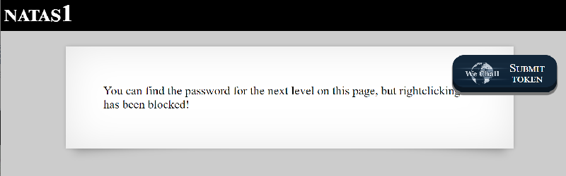
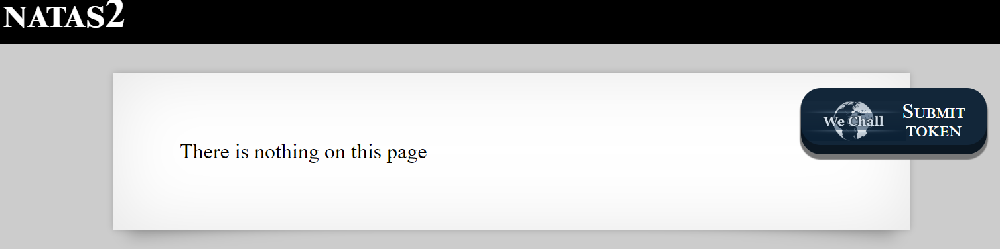
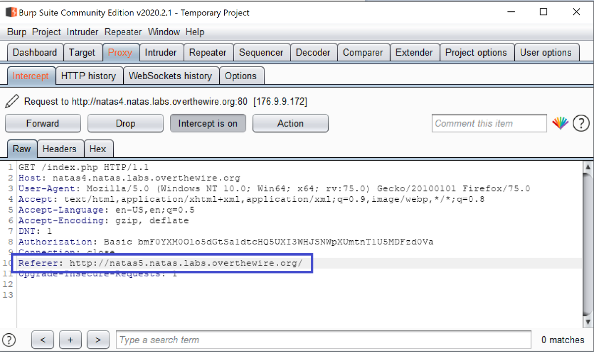

# Natas

Each level of natas consists of its own website located at [http://natasX.natas.labs.overthewire.org](http://natasX.natas.labs.overthewire.org), where X is the level number. There is **no SSH login**. To access a level, enter the username for that level \(e.g. natas0 for level 0\) and its password.

Each level has access to the password of the next level. Your job is to somehow obtain that next password and level up. **All passwords are also stored in /etc/natas\_webpass/**. E.g. the password for natas5 is stored in the file /etc/natas\_webpass/natas5 and only readable by natas4 and natas5.

## Level 0


You can right click to view source or in your browser \(chrome\) `ctrl+shift+i` and find it inside main body html.

### Level 1



With right-click disabled, see it in the same place using developer tools.

### Level 2



Looking at the source of index file

```http
<div id="content">
There is nothing on this page

</div>
```

In the url browser go to [`http://natas2.natas.labs.overthewire.org/files/`](http://natas2.natas.labs.overthewire.org/files/). There you will see the text file called users.txt and that is where the pw is.

### Level 3

With the same message as level 2, there is a difference in the index.html

```http
<h1>natas3</h1>
<div id="content">
There is nothing on this page
<!-- No more information leaks!! Not even Google will find it this time... -->
</div>
```

This indicates usage of robots.txt to prevent webcrawlers \(e.g. Google\) from indexing site or particular location on server.[ \[info\]](https://www.robotstxt.org/) It is usually located in the root directory. [`http://natas3.natas.labs.overthewire.org/robots.txt`](http://natas3.natas.labs.overthewire.org/robots.txt)\`\`

> User-agent: \*   
> Disallow: /s3cr3t/

The content of this robots.txt shows that it blocks all robots from going to folder s3cr3t. So go to [`http://natas3.natas.labs.overthewire.org/s3cr3t/`](http://natas3.natas.labs.overthewire.org/s3cr3t/) and you wil see the user.txt.

### Level 4


HTTP referrer problem. Run burp suite and change proxy in browser. [\[Tutorial to setup Burp\]](../../tools-setup/burp-suite.md)  
Once Burp is running, hit the Refresh page link and you will see the following in Burp.


Manually change the Referer to natas5 and click Forward.



The browser will be reloaded with the next level's password.

### Level 5


