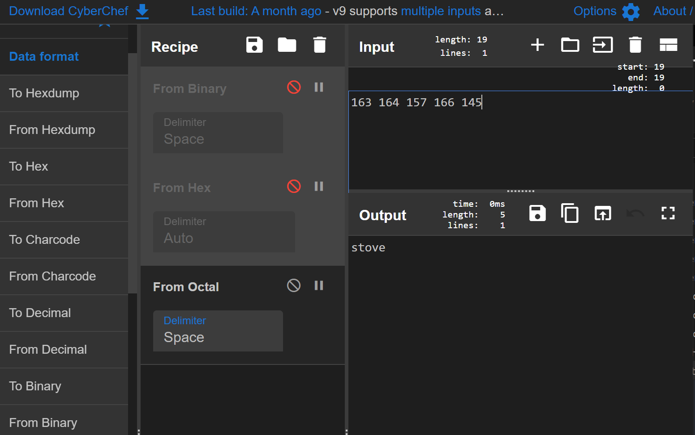

# General Skills


### **grep 1 - Points: 75**

> Can you find the flag in [file](https://2018shell.picoctf.com/static/805ac70722810caa0b1c02bc88ef68d8/file)? This would be really obnoxious to look through by hand, see if you can find a faster way. You can also find the file in /problems/grep-1\_0\_c0c0c16438cdbee39591397e16389f59 on the shell server.

```bash
tokumeipoh@pico-2018-shell:/problems/grep-1_0_c0c0c16438cdbee39591397e16389f59$ cat file | grep "picoCTF{"
picoCTF{grep_and_you_will_find_52e63a9f}
```

### **net cat - Points: 75**

> Using netcat \(nc\) will be a necessity throughout your adventure. Can you connect to `2018shell.picoctf.com` at port `22847` to get the flag?

```text
tokumeipoh@pico-2018-shell:~$ nc 2018shell.picoctf.com 22847
That wasn't so hard was it?
picoCTF{NEtcat_iS_a_NEcESSiTy_69222dcc}
```


### **strings - Points: 100**

> Can you find the flag in this [file](https://2018shell.picoctf.com/static/e78981e684a62559baaef12a27f0e918/strings) without actually running it? You can also find the file in /problems/strings\_0\_bf57524acf558aca2081eb97ece8e2ee on the shell server.

Using strings alone will show too much information in terminal, therefore, use grep also to find flag.

```text
tokumeipoh@pico-2018-shell:~$ strings /problems/strings_0_bf57524acf558aca2081eb97ece8e2ee/strings | grep 
"picoCTF{"
picoCTF{sTrIngS_sAVeS_Time_c09b1444}
```

### **pipe - Points: 110**

> During your adventure, you will likely encounter a situation where you need to process data that you receive over the network rather than through a file. Can you find a way to save the output from this program and search for the flag? Connect with `2018shell.picoctf.com 2015`

```text
tokumeipoh@pico-2018-shell:~$ nc 2018shell.picoctf.com 2015 | grep "picoCTF{"
picoCTF{almost_like_mario_8861411c}
```

### **Inspect Me - Points: 125**

> Inpect this code! `http://2018shell.picoctf.com:56252` \([link](http://2018shell.picoctf.com:56252/)\)

Load the page in browser and start developer tools with ctrl+shift+i. Under sources tab, in main folder called 2018shell.picoctf.com:56252 will be 3 files.   
- \(index\) at line 31 is 1/3 of flag: picoCTF{ur\_4\_real\_1nspe  
- mycss.css at line 51 is 2/3 of flag: ct0r\_g4dget\_9dd3b33c}  
- 3/3 of flag is not really needed because we already have completed flag.

### **grep 2 - Points: 125**

> This one is a little bit harder. Can you find the flag in /problems/grep-2\_2\_413a577106278d0711d28a98f4f6ac28/files on the shell server? Remember, grep is your friend.

```bash
tokumeipoh@pico-2018-shell:/problems/grep-2_2_413a577106278d0711d28a98f4f6ac28/files$ ll
total 48
drwxr-xr-x 12 root root 4096 Mar 25  2019 ./     
drwxr-xr-x  3 root root 4096 Mar 25  2019 ../    
drwxr-xr-x  2 root root 4096 Mar 25  2019 files0/
drwxr-xr-x  2 root root 4096 Mar 25  2019 files1/
drwxr-xr-x  2 root root 4096 Mar 25  2019 files2/
drwxr-xr-x  2 root root 4096 Mar 25  2019 files3/
drwxr-xr-x  2 root root 4096 Mar 25  2019 files4/
drwxr-xr-x  2 root root 4096 Mar 25  2019 files5/
drwxr-xr-x  2 root root 4096 Mar 25  2019 files6/
drwxr-xr-x  2 root root 4096 Mar 25  2019 files7/
drwxr-xr-x  2 root root 4096 Mar 25  2019 files8/
drwxr-xr-x  2 root root 4096 Mar 25  2019 files9/
tokumeipoh@pico-2018-shell:/problems/grep-2_2_413a577106278d0711d28a98f4f6ac28/files$ grep -r "picoCTF{" 
../files5/file24:picoCTF{grep_r_and_you_will_find_8eb84049}
```

### **Aca-Shell-A - Points: 150**

> It's never a bad idea to brush up on those linux skills or even learn some new ones before you set off on this adventure! Connect with `nc 2018shell.picoctf.com 33158`.

This challenge is timed! It seems like you are interactive with an AI within the terminal.   
1. you have to delete all files in "secret" folder  
2. go into executables folder to retrieve and run exploit file  
3. you will be prompted to copy a file from the tmp folder to passwords folder and then view the file

```bash
Sweet! We have gotten access into the system but we aren't root.
It's some sort of restricted shell! I can't see what you are typing
but I can see your output. I'll be here to help you along.
If you need help, type "echo 'Help Me!'" and I'll see what I can do
There is not much time left!
~/$ cd secret
Now we are cookin'! Take a look around there and tell me what you find!
~/secret$ ls
intel_1
intel_2
intel_3
intel_4
intel_5
profile_ahqueith5aekongieP4ahzugi
profile_ahShaighaxahMooshuP1johgo
profile_aik4hah9ilie9foru0Phoaph0
profile_AipieG5Ua9aewei5ieSoh7aph
profile_bah9Ech9oa4xaicohphahfaiG
profile_ie7sheiP7su2At2ahw6iRikoe
profile_of0Nee4laith8odaeLachoonu
profile_poh9eij4Choophaweiwev6eev
profile_poo3ipohGohThi9Cohverai7e
profile_Xei2uu5suwangohceedaifohs
Sabatoge them! Get rid of all their intel files!
~/secret$ rm intel*
Nice! Once they are all gone, I think I can drop you a file of an exploit!
Just type "echo 'Drop it in!' " and we can give it a whirl!
~/secret$ echo "drop it in!"
Drop it in!
I placed a file in the executables folder as it looks like the only place we can execute from!
Run the script I wrote to have a little more impact on the system!
~/secret$ cd ..
~/$ cd executables
~/executables$ ls
dontLookHere
~/executables$ ./dontLookHere          
 d940 ecc3 9426 5624 2976 8abf 7cf1 2d8e 32b0 063b 2f48 44c9 d9cb efad b644 a481 3e24 0536 7b7e dcf8 c2c2
b4db 0c21 3b0c 6881
 94eb 4e23 3918 086d 09b7 1935 8547 ee90 4ddd 2e61 845a b19f d09a 3419 c1dc c74e f2a7 c29e 971e 3342 5d3f
5b21 1397 373b ece3
.
.
.
  3376 28be a382 4dbe dd95 8686 4725 561c 6476 7dea a804 5eed 980a 4080 6319 758c d616 3aa1 c108 26ac e6c2
a2a8 2e7f fb5c 6025
 2e32 11ca 772f 52d7 bbf5 359c 5f32 3b91 d03a 34ef 41d9 30fc 1186 1f6c b6c0 6d57 fb76 9238 45e7 5755 c4d7
a052 aa36 75f8 8b77
Looking through the text above, I think I have found the password. I am just having trouble with a usernae.
Oh drats! They are onto us! We could get kicked out soon!
Quick! Print the username to the screen so we can close are backdoor and log into the account directly!
You have to find another way other than echo!
~/executables$ whoami
l33th4x0r
Perfect! One second!
Okay, I think I have got what we are looking for. I just need to to copy the file to a place we can read.
Try copying the file called TopSecret in tmp directory into the passwords folder.
~/executables$ cd ..
~/$ cp /tmp/TopSecret passwords
~/$ cd passwords
~/passwords$ ls
TopSecret
~/passwords$ cat TopSecret
Major General John M. Schofield's graduation address to the graduating class of 1879 at West Point is as follows: The discipline which makes the soldiers of a free country reliable in battle is not to be gained by harlh or tyrannical treatment.On the contrary, such treatment is far more likely to destroy than to make an army.It is possible to impart instruction and give commands in such a manner and such a tone of voice as to insplows: The discipline which makes the soldiers of a free country reliable in battle is not to be gained by hnot fail to excite strong resentment and a desire to disobey.The one mode or other of dealing with subordinatea springs from a corresponding spirit in the breast of the commander.He who feels the respect which is due to others, cannot fail to inspire in them respect for himself, while he who feels,and hence manifests disrespe~/$ cd passwords~/passwords$ lsTopSecret~/passwords$ cat TopSecretMajor General John M. Schofield's graduation address to the graduating class of 1879 at West Point is as follows: The discipline which makes the soldiers of a free country reliable in battle is not to be gained by 
harsh or tyrannical treatment.On the contrary, such treatment is far more likely
```

### **environ - Points: 150**

> Sometimes you have to configure environment variables before executing a program. Can you find the flag we've hidden in an environment variable on the shell server?  
> Hint:  unix [env](https://www.tutorialspoint.com/unix/unix-environment.htm)

```text
# printenv prints all environmental variables
printenv | grep "picoCTF"
```

### **Ssh-keyz - Points: 150**

> As nice as it is to use our webshell, sometimes its helpful to connect directly to our machine. To do so, please add your own public key to ~/.ssh/authorized\_keys, using the webshell. The flag is in the ssh banner which will be displayed when you login remotely with ssh to with your username.  
> Hint: key generation [tutorial](https://confluence.atlassian.com/bitbucketserver/creating-ssh-keys-776639788.html). We also have an expert demonstrator to help you along. [link](https://www.youtube.com/watch?v=3CN65ccfllU&list=PLJ_vkrXdcgH-lYlRV8O-kef2zWvoy79yP&index=4)

Keys are located in home directory in .ssh folder. Remember to back up old keys if they exists!

```bash
# go to home folder and into .ssh (or make folder if doesnt exist)
cd
cd .ssh
ssh-keygen -t rsa -C "your_email@example.com"
# press Enter to accept default location
# passphrase (or blank) and Enter twice
# view key
cat id_rsa.pub
```

Now login to picoctf

```bash
mkdir .ssh && cd $_
cat > authorized_keys
# paste key and press enter
# logoff and logon to see flag
```

picoCTF{who\_n33ds\_p4ssw0rds\_38dj21}

### **What base is this? - Points: 200**

> To be successful on your mission, you must be able read data represented in different ways, such as hexadecimal or binary. Can you get the flag from this program to prove you are ready? Connect with `nc 2018shell.picoctf.com 1225`.  
> Hint: I hear python is a good means \(among many\) to convert things. It might help to have multiple windows open

The server will ask you to format 3 things into ascii: binary, hex, and octal data. I used cyberchef and had the three conversions loaded into the recipe and disabled the ones I did not use.



```bash
poh@pohSurface:/mnt/c/Users/poh$ nc 2018shell.picoctf.com 1225
We are going to start at the very beginning and make sure you understand how data is stored.
toxic
Please give me the 01110100 01101111 01111000 01101001 01100011 as a word.
To make things interesting, you have 30 seconds.
Input:
toxic
Please give me the 737469746368 as a word.
Input:
stitch
Please give me the  163 164 157 166 145 as a word.
Input:
stove
You got it! You're super quick!
Flag: picoCTF{delusions_about_finding_values_451a9a74}
```

Python script:

```python
from contextlib import contextmanager
import socket

@contextmanager
def sock():
	s = socket.socket(socket.AF_INET, socket.SOCK_STREAM)
	try:
		yield s
	finally:
		s.close()

def recvUntil(io, str):
	result = ""
	while str not in result:
		result += io.recv(1).decode()
	return repr(result)

def recvIntro(io):
	result = ""
	"""
		5 lines will be received in intro:
		We are going to start ...
		answer to first input (weird)
		Please give me ...
		To make things interesting,...
		Input:
	"""
	count = 0
	while count <= 4:
		line = recvUntil(io, '\n')
		print(line)
		if count == 2:
			result = line
		count += 1
	return result


def parseWord(str, base):
	# word is always in this format:
	# str = "Please give me the xxxxx as a word.\n"
	# word = str[20:-11] from index 20 to the 13th char from the end
	word = str[20:-13]
	print("word is: ", word)
	answer = ""
	if base == 2:
		# word = a string of 8 digits (1s and 0s) separated by spaces
		word = word.split()  # remove spaces
		for byte in word:
			integer = int(byte, base=2)
			character = chr(integer)
			answer += character
	elif base == 16:
		# word is a string of hexvalues
		word = bytearray.fromhex(word)
		answer = word.decode()
	else:
		# word is a string of 3 digits separated by spaces
		# convert string to int, then to oct
		word = word.split()
		for value in word:
			value = int(value, base=8)
			answer += chr(value)

	print(answer)
	answer += '\n'
	return answer

with sock() as io:
	io.connect( ("2018shell.picoctf.com", 1225) )
	line = recvIntro(io)
	io.send(parseWord(line, 2).encode())
	
	line = recvUntil(io, '\n')
	recvUntil(io,'\n') # Input:
	io.send(parseWord(line, 16).encode())
	
	line = recvUntil(io, '\n')
	recvUntil(io,'\n') # Input:
	io.send(parseWord(line, 8).encode())

	print(recvUntil(io, "}\n"))
```

### **You can't see me - Points: 200**

> '...reading transmission... Y.O.U. .C.A.N.'.T. .S.E.E. .M.E. ...transmission ended...' Maybe something lies in /problems/you-can-t-see-me\_1\_a7045a1e39ce834c26556a81c2b3a74f.  
> Hint: What command can see/read files? What's in the manual page of ls?

```bash
tokumeipoh@pico-2018-shell:/problems/you-can-t-see-me_1_a7045a1e39ce834c26556a81c2b3a74f$ ll
total 60
drwxr-xr-x   2 root       root        4096 Mar 25  2019 ./
-rw-rw-r--   1 hacksports hacksports    57 Mar 25  2019 .
drwxr-x--x 556 root       root       53248 Mar 25  2019 ../
```

There seems to be a hidden file called "." and because of that you can't use the command `cat .` or `cat ./.`. You can type cat and press tab to autocomplete and access that file instead. Another way is by grep with optional -recursively because it consider the file "." to be a directory.

```bash
tokumeipoh@pico-2018-shell:/problems/you-can-t-see-me_1_a7045a1e39ce834c26556a81c2b3a74f$ cat .\ \  
picoCTF{j0hn_c3na_paparapaaaaaaa_paparapaaaaaa_f01e45c4}
tokumeipoh@pico-2018-shell:/problems/you-can-t-see-me_1_a7045a1e39ce834c26556a81c2b3a74f$ grep -r "picoCTF" .
./.  :picoCTF{j0hn_c3na_paparapaaaaaaa_paparapaaaaaa_f01e45c4}
```


