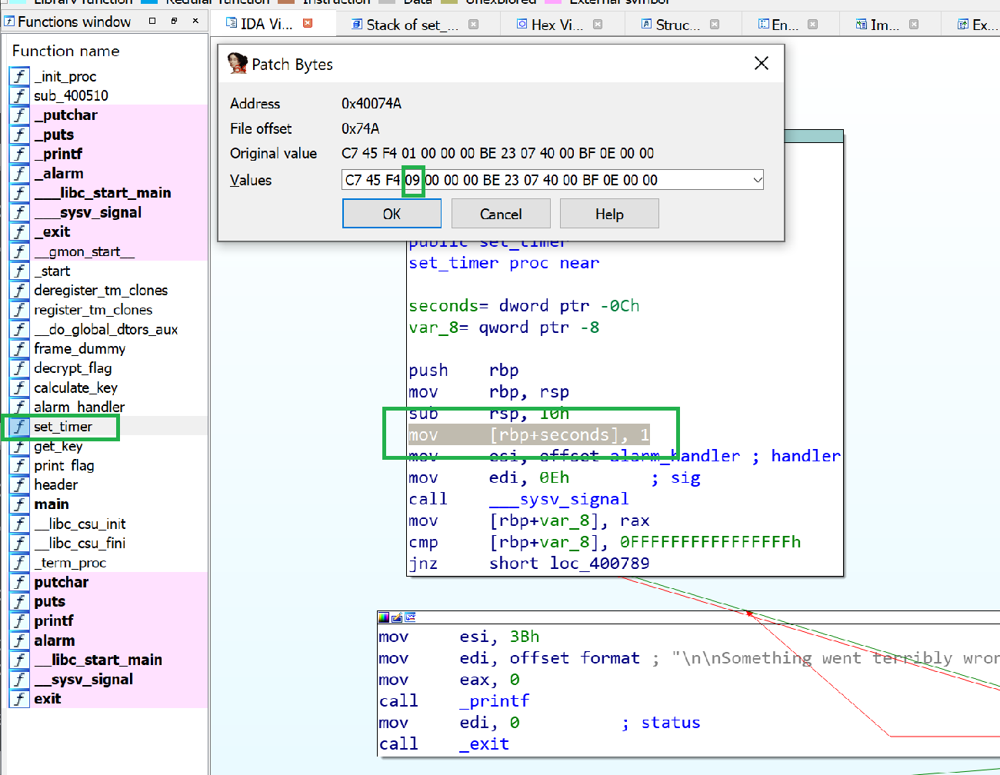
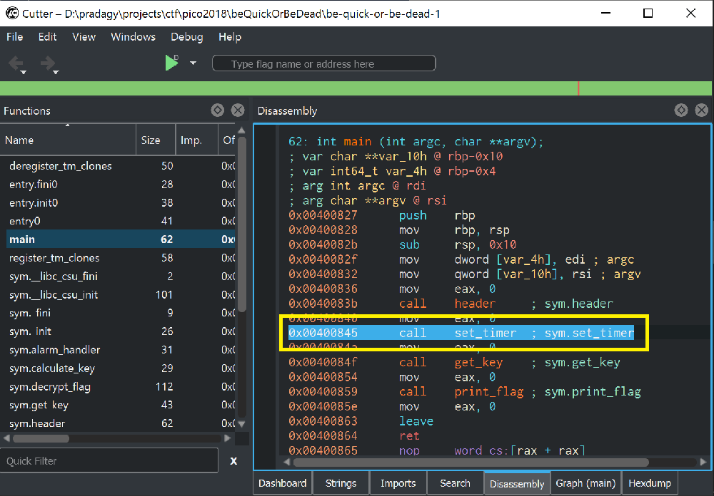
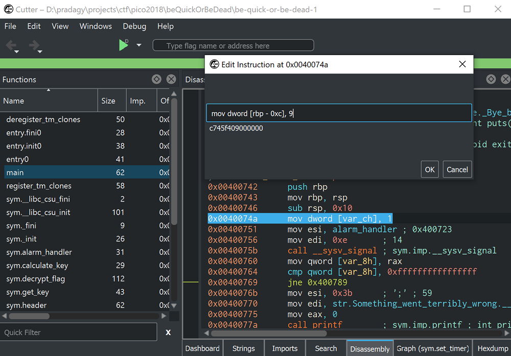

# Reversing

### Compile and Execute .S files

sample.s file:

```nasm
.intel_syntax noprefix
.bits 32

.global asm3

asm3:
	push   	ebp
	mov    	ebp,esp
	mov	eax,0x19
	xor	al,al
	mov	ah,BYTE PTR [ebp+0xa]
	sal	ax,0x10
	sub	al,BYTE PTR [ebp+0xd]
	add	ah,BYTE PTR [ebp+0xc]
	xor	ax,WORD PTR [ebp+0x12]
	mov	esp, ebp
	pop	ebp
	ret
```

we can make it a shared library and export its function asm3. let’s just make it compatible with nasm assembler: delete the ‘PTR’ and change the first lines as follows:

```nasm
section .text
global asm3

asm3:
	push   	ebp
	mov    	ebp,esp
	mov	eax,0x19
	xor	al,al
	mov	ah,BYTE [ebp+0xa]
	sal	ax,0x10
	sub	al,BYTE [ebp+0xd]
	add	ah,BYTE [ebp+0xc]
	xor	ax,WORD [ebp+0x12]
	mov	esp, ebp
	pop	ebp
	ret
```

now we can write a little C program that uses the exported library:

```C
#include <stdio.h>
extern int asm3(int a, int b, int c);

int main(void) {

	printf("0x%x\n", asm3(0xb5e8e971,0xc6b58a95,0xe20737e9));

	return 0;
}
```

for the number of arguments of the asm function, you can look at the problem description. asm3 is declared as extern, meaning it will look for it in another file at compile\(/linking?\) time. now just compile them together and execute the resulting executable

```bash
[andrei@jacky 15:27:00] ~/Documents/pico/3
——> nasm -f elf32 end_asm_rev.S -o asmfun.o
[andrei@jacky 15:27:42] ~/Documents/pico/3
——> gcc sol.c asmfun.o -o sol -m32
[andrei@jacky 15:27:59] ~/Documents/pico/3
——> ./sol
0x7771
```

### **Assembly-0 - Points: 150**

> What does asm0\(0xaa,0xf2\) return? Submit the flag as a hexadecimal value \(starting with '0x'\). NOTE: Your submission for this question will NOT be in the normal flag format. [Source](https://2018shell.picoctf.com/static/5359d5442f2379ae9948dfeebe80d8f8/intro_asm_rev.S) located in the directory at /problems/assembly-0\_2\_485b2d48345b19addbeb06a36aabdc74.  
> Hint: 
>
> * basical assembly [tutorial](https://www.tutorialspoint.com/assembly_programming/assembly_basic_syntax.htm)
> * assembly [registers](https://www.tutorialspoint.com/assembly_programming/assembly_registers.htm)

The following is the context of the assembly file.

```text
.intel_syntax noprefix
.bits 32
	
.global asm0

asm0:
	push	ebp				
	mov	ebp,esp
	mov	eax,DWORD PTR [ebp+0x8]
	mov	ebx,DWORD PTR [ebp+0xc]
	mov	eax,ebx
	mov	esp,ebp
	pop	ebp	
	ret
```

Breakdown of code:

```text
push    ebp
mov     ebp, esp
```

Those two lines are what's is called the function prologue. We first save the calling function stack frame \(`ebp` is tracking that\) and in the second one, we set our function stack frame to be equal to the current stack location.

```text
mov eax, DWORD PTR [ebp+0x8]
mov ebx, DWORD PTR [ebp+0xc]
```

The above lines are loading our passed arguments to `eax` and `ebx`.  `eax`  will have `0xaa` and `ebx` will be equal to `0xf2`.

```text
mov eax, ebx
```

The value from `ebx` is stored in `eax`, thus we drop the need of the first line from the previous fragment. `eax` is usually the register containing the return value, in this case would be `0xf2`.

```text
mov esp,ebp
pop ebp
```

This is just bringing back the stack as it was when we enter the function - also called function epilogue.

```text
ret
```

picoCTF{0xf2}

### **Assembly-1 - Points: 200**

> What does asm1\(0xcd\) return? Submit the flag as a hexadecimal value \(starting with '0x'\). NOTE: Your submission for this question will NOT be in the normal flag format. [Source](https://2018shell.picoctf.com/static/d0e1ee3fb4731170df828a2a6c81034a/eq_asm_rev.S) located in the directory at /problems/assembly-1\_2\_ac6a59ca77a2d619ddabb3c3ffedb9a8.  
> Hint:  assembly [conditions](https://www.tutorialspoint.com/assembly_programming/assembly_conditions.htm)

Content of file:

```text
.intel_syntax noprefix
.bits 32

.global asm1

asm1:
        push    ebp                      ; func prologue
        mov     ebp,esp                  ; func prologue        
        cmp     DWORD PTR [ebp+0x8],0xde         
        jg      part_a                   
        cmp     DWORD PTR [ebp+0x8],0x8 
        jne     part_b
        mov     eax,DWORD PTR [ebp+0x8] 
        add     eax,0x3
        jmp     part_d
part_a:
        cmp     DWORD PTR [ebp+0x8],0x4e
        jne     part_c
        mov     eax,DWORD PTR [ebp+0x8]
        sub     eax,0x3
        jmp     part_d
part_b:
        mov     eax,DWORD PTR [ebp+0x8]
        sub     eax,0x3
        jmp     part_d
        cmp     DWORD PTR [ebp+0x8],0xee
        jne     part_c
        mov     eax,DWORD PTR [ebp+0x8]
        sub     eax,0x3
        jmp     part_d
part_c:
        mov     eax,DWORD PTR [ebp+0x8]
        add     eax,0x3
part_d:
        pop     ebp
        ret
```

Actual code starts at line 9, where argument passed is 0xcd

9: compare argument with 0xde  
10: if argument passed is greater than 0xde, jump to part\_a  
11: compare arg with 0x8  
12: if arg not equal to 0x8, jump to part\_b  
22: part\_b: move argument, 0xcd to register eax.  \[eax=0xcd\]  
23: subtract 0x3 from eax. \[eax=0xca\]  
24: jump to part\_d  
35: pop base pointer  
36: ret always returns value in eax which is 0xca

### **Be-quick-or-be-dead-1 - Points: 200**

> You find [this](https://www.youtube.com/watch?v=CTt1vk9nM9c) when searching for some music, which leads you to [be-quick-or-be-dead-1](https://2018shell.picoctf.com/static/14d5f9d228520b83cab25561b3a75abf/be-quick-or-be-dead-1). Can you run it fast enough? You can also find the executable in /problems/be-quick-or-be-dead-1\_2\_83a2a5193f0340b364675a2f0cc4d71e.  
> Hint: What will the key finally be?

The file can be directly downloaded from the server using [scp - Securely Copy Files](https://haydenjames.io/linux-securely-copy-files-using-scp/)

Running the program yields:

```text
tokumeipoh@pico-2018-shell:/problems/be-quick-or-be-dead-1_2_83a2a5193f0340b364675a2f0cc4d71e$ ./be-quick-or-be-dead-1
Be Quick Or Be Dead 1
=====================

Calculating key...   
You need a faster machine. Bye bye.
```

#### IDA Method:

You first can use IDA and see in the main function what is going on

```text
; int __cdecl main(int argc, const char **argv, const char **envp)
public main
main proc near ; DATA XREF: _start+1D↑o

var_10  = qword ptr -10h
var_4   = dword ptr -4

push    rbp
mov     rbp, rsp
sub     rsp, 10h
mov     [rbp+var_4], edi
mov     [rbp+var_10], rsi
mov     eax, 0
call    header
mov     eax, 0
call    set_timer
mov     eax, 0
call    get_key
mov     eax, 0
call    print_flag
mov     eax, 0
leave
retn
```

it seems like there is a set\_timer function that we can look at and edit. Originally it was passed one second to the alarm\(\) and maybe we can extend it to 9 seconds instead. With the set\_timer function opened in IDA, highlight the parameter we need to change. Then go to Edit &gt; Patch Program &gt; Change Byte ... Then you will be shown the whole instruction and change the parameter like from   
C7 45 F4 01 00 00 00 BE 23 07 40 00 BF 0E 00 00  
to   
C7 45 F4 09 00 00 00 BE 23 07 40 00 BF 0E 00 00



Then go to Edit &gt; Patch Program &gt; Apply patches to input file ... . Click OK and then rerun the program again.

```text
poh@pohSurface:/mnt/d/pradagy/projects/ctf/pico2018/beQuickOrBeDead$ ./be-quick-or-be-dead-1
Be Quick Or Be Dead 1
=====================

Calculating key...
Done calculating key
Printing flag:
picoCTF{why_bother_doing_unnecessary_computation_d0c6aace}
```

#### Cutter Method \(radare2 GUI version\)

Open the file in cutter and check the box that opens in write mode. 



Open main function and double click set\_timer to go to that functions's location.



Then at the instruction where it passes a 1 to the alarm function later on. Right-click the instruction &gt; Edit &gt; Instruction and change the value to 9.

#### Radare2 method

Install instructions for linux. For any questions type command with question mark attached at the end of it.

```bash
git clone https://github.com/radare/radare2
cd radare2
sys/install.sh   # just run this script to update r2 from git
```

Then run these commands to patch file

```bash
r2 be-quick-or-be-dead-1
[0x00400738]> oo+             # reopen file for write enabled mode
[0x00400738]> s 0x0040074a    # seek to that address
[0x0040074a]> pd 1            # disassemble N instruction
            0x0040074a      c745f4010000.  mov dword [rbp - 0xc], 1
[0x0040074a]> wa mov dword [rbp -0xc], 9 # write assembly instruction
Written 7 byte(s) (mov dword [rbp -0xc], 9) = wx c745f408000000
[0x0040074a]> q
```

Execute the file.

#### GDB method

By far this was the easiest method: using gdb and calling necessary functions. It just required you to know what functions were called from main.

```text
tokumeipoh@pico-2018-shell:/problems/be-quick-or-be-dead-1_2_83a2a5193f0340b364675a2f0cc4d71e$ gdb be-quick-or-be-dead-1
GNU gdb (Ubuntu 7.11.1-0ubuntu1~16.5) 7.11.1
Copyright (C) 2016 Free Software Foundation, Inc.
License GPLv3+: GNU GPL version 3 or later <http://gnu.org/licenses/gpl.html>
This is free software: you are free to change and redistribute it.
There is NO WARRANTY, to the extent permitted by law.  Type "show copying"
and "show warranty" for details.
This GDB was configured as "x86_64-linux-gnu".
Type "show configuration" for configuration details.
For bug reporting instructions, please see:
<http://www.gnu.org/software/gdb/bugs/>.
Find the GDB manual and other documentation resources online at:
<http://www.gnu.org/software/gdb/documentation/>.
For help, type "help".
Type "apropos word" to search for commands related to "word"...
Reading symbols from be-quick-or-be-dead-1...(no debugging symbols found)...done.
(gdb) break main
Breakpoint 1 at 0x40082b
(gdb) run
Starting program: /problems/be-quick-or-be-dead-1_2_83a2a5193f0340b364675a2f0cc4d71e/be-quick-or-be-dead-1

Breakpoint 1, 0x000000000040082b in main ()
(gdb) call get_key()
Calculating key...
Done calculating key
$1 = 21
(gdb) call print_flag()
Printing flag:
picoCTF{why_bother_doing_unnecessary_computation_d0c6aace}
$2 = 59
(gdb)
```

### **Quackme - Points: 200**

> Can you deal with the Duck Web? Get us the flag from this [program](https://2018shell.picoctf.com/static/3a9e7a6330d134243900d8413b326a60/main). You can also find the program in /problems/quackme\_0\_29c1eeadf7509d3b370e5d76c6fa54e5.  
> Hint: Objdump or something similar is probably a good place to start.

There are two ways to inspect this binary, I will thoroughly discuss one way to learn more about reading assembly code and the other way is to use objdump and get to the information directly. So by using any disassembler \(ghidra was good for graphically and radare2 was good for retrieving direct information\)

```bash
; int __cdecl main(int argc, const char **argv, const char **envp)
public main
main proc near ; DATA XREF: _start+17↑o

var_4 = dword ptr -4
argc  = dword ptr  8
argv  = dword ptr  0Ch
envp  = dword ptr  10h

lea     ecx, [esp+4]
and     esp, 0FFFFFFF0h
push    dword ptr [ecx-4]
push    ebp
mov     ebp, esp
push    ecx
sub     esp, 4
mov     eax, ds:stdout@@GLIBC_2_0
push    0
push    2
push    0
push    eax
call    _setvbuf
add     esp, 10h
sub     esp, 0Ch
push    offset aYouHaveNowEnte ; "You have now entered the Duck Web, and "...
call    _puts
add     esp, 10h
call    do_magic ; Interesting!
sub     esp, 0Ch
push    offset aThatSAllFolks ; "That's all folks."
call    _puts
add     esp, 10h
mov     eax, 0
mov     ecx, [ebp+var_4]
leave
lea     esp, [ecx-4]
retn
main            endp
```

In the main function, it prints a greeting message, calls a function do\_magic, prints another message, and then exits.  So the only interesting part is the function do\_magic


