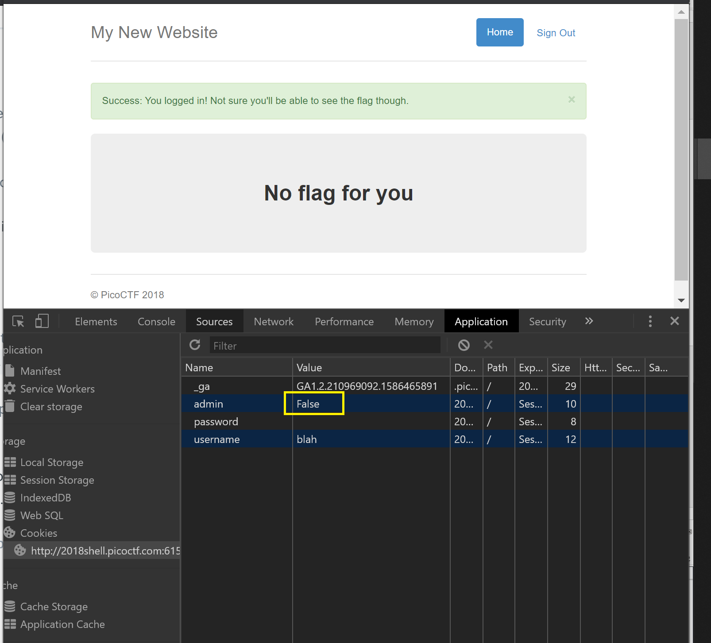
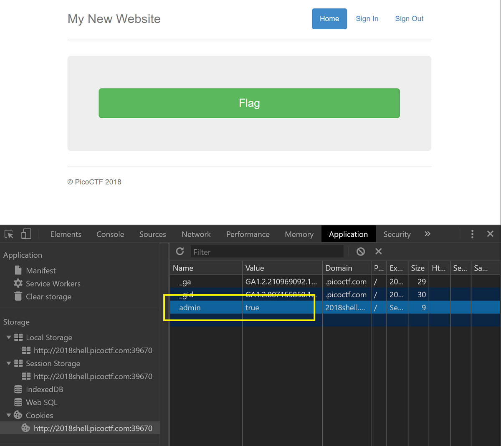

# Web Exploitation

### **Client Side is Still Bad - Points: 150**

> I forgot my password again, but this time there doesn't seem to be a reset, can you help me? `http://2018shell.picoctf.com:8249` \([link](http://2018shell.picoctf.com:8249/)\)
>
> Hints: Client Side really is a bad way to do it.

Just check the source code of index and it is in lines 13-20.  
picoCTF{client\_is\_bad\_9117e9}

### **Logon - Points: 150**

> I made a website so now you can log on to! I don't seem to have the admin password. See if you can't get to the flag. `http://2018shell.picoctf.com:6153` \([link](http://2018shell.picoctf.com:6153/)\)  
> [Hint](https://2018game.picoctf.com/problems#4ac8adb65bddd8227e72bbec6fa34364hint)**s**  
> Hmm it doesn't seem to check anyone's password, except for admins? How does check the admin's password?

When going to the page, there is a login prompt. I tried signing in as user "blah" and left the password empty. Then this page shows up.



In developer tools, go to Application tab, Cookies in sidebar and you will see the value of admin = false. Change it to True and refresh the page.  
picoCTF{l0g1ns\_ar3nt\_r34l\_82e795f4}

### **Irish Name Repo - Points: 200** 

> There is a website running at `http://2018shell.picoctf.com:59464` \([link](http://2018shell.picoctf.com:59464/)\). Do you think you can log us in? Try to see if you can login!  
> Hint: There doesn't seem to be many ways to interact with this, I wonder if the users are kept in a database?

With username = admin, different passwords will work :  
`' or 1--`  The `--` at the end are to ensure every piece of SQL code after our injected code is interpreted by the database engine as a comment and thus ignored.  
`' or 'x'='x`   
Even this will work: username and password =  `1' or '1' = '1`

Logged in!

Your flag is: picoCTF{con4n\_r3411y\_1snt\_1r1sh\_d121ca0b}

### **Mr. Robots - Points: 200** 

> Do you see the same things I see? The glimpses of the flag hidden away? `http://2018shell.picoctf.com:29568` \([link](http://2018shell.picoctf.com:29568/)\)  
> Hint: What part of the website could tell you where the creator doesn't want you to look?

The main page does not show us anything useful. With the help of the hint, referring to robots.txt, I loaded the page [`http://2018shell.picoctf.com:29568/robots.txt`](http://2018shell.picoctf.com:29568/robots.txt) and saw that it disallowed the /74efc.html. [\[more info\]](https://www.robotstxt.org/)   
This meant the server does not want crawlers to see that page. Going to it shows the flag. [http://2018shell.picoctf.com:29568/74efc.html](http://2018shell.picoctf.com:29568/74efc.html)

### **No Login - Points: 200**

> Looks like someone started making a website but never got around to making a login, but I heard there was a flag if you were the admin. `http://2018shell.picoctf.com:39670` \([link](http://2018shell.picoctf.com:39670/)\)  
> Hint: What is it actually looking for in the cookie?

Using the developer tools you can go into picoctf's cookie and add a new name/value = admin/true. Click the green Flag button to reveal the flag.



You can also use the Console in dev tool and enter `document.cookie = "admin=True";`  
and then press flag button.  
Another method is by using a python script to send http request along with the cookie. [\[more info\]](https://requests.readthedocs.io/en/latest/user/quickstart/#make-a-request)

```python
import requests
import re

# create cookie
jar = {"admin": "True"}
# make GET request with cookie
req = requests.get("http://2018shell.picoctf.com:33889/flag", cookies=jar)
# save RESPONSE content in text version, no brackets needed 
reply = req.text
# show regex of flag.
# r' means find raw string where \n means two characters \ and n, not newline
print(re.findall(r'picoCTF\{.+\}', reply))
```

picoCTF{n0l0g0n\_n0\_pr0bl3m\_50e16a5c}

### **Secret Agent - Points: 200** 

> Here's a little website that hasn't fully been finished. But I heard google gets all your info anyway. `http://2018shell.picoctf.com:11421` \([link](http://2018shell.picoctf.com:11421/)\)  
> Hint: How can your browser pretend to be something else?

When clicking the flag button, you get this msg: You're not google! Mozilla/5.0 \(Windows NT 10.0; Win64; x64\) AppleWebKit/537.36 \(KHTML, like Gecko\) Chrome/80.0.3987.163 Safari/537.36

In python, i've set a [custom header parameter "user-agent"](https://requests.readthedocs.io/en/latest/user/quickstart/#custom-headers) and used one of google's many bots or webcrawlers [here](https://support.google.com/webmasters/answer/1061943). I used Googlebot desktop version and sent the GET request.

```python
import requests
import re

userAgent = {"user-agent": "Mozilla/5.0 (compatible; Googlebot/2.1; +http://www.google.com/bot.html)"}
url = "http://2018shell.picoctf.com:11421/flag"
req = requests.get(url, headers=userAgent)
print((re.findall(r'picoCTF\{.+\}', req.text)))

```

picoCTF{s3cr3t\_ag3nt\_m4n\_ed3fe08d}

