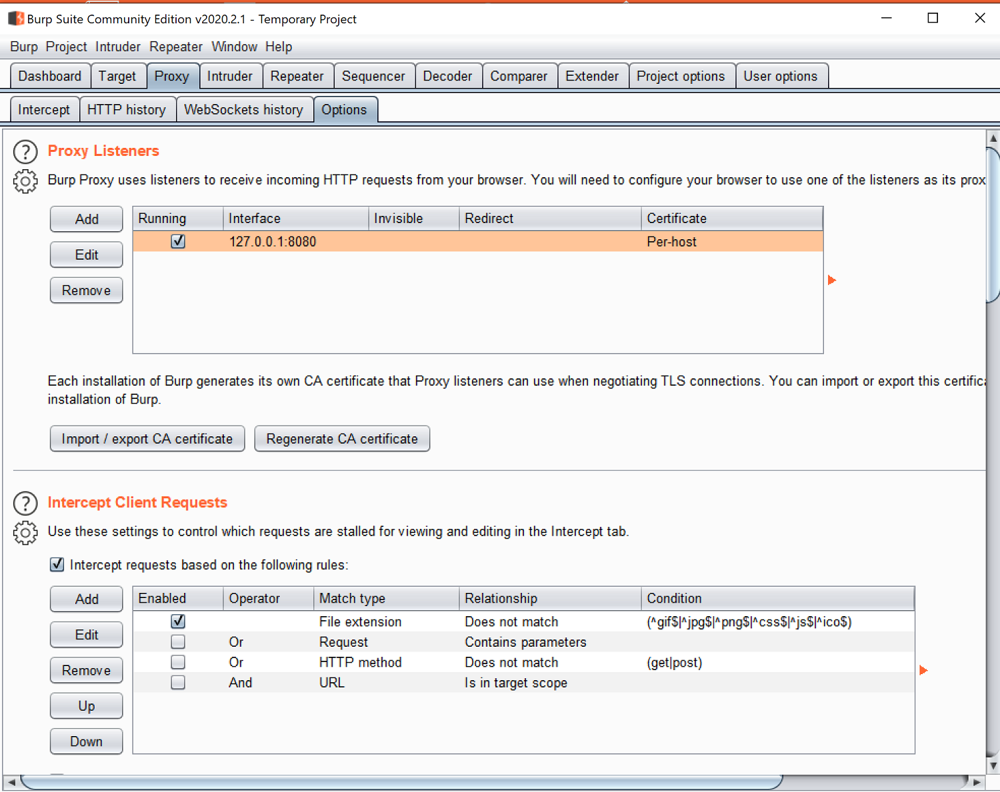
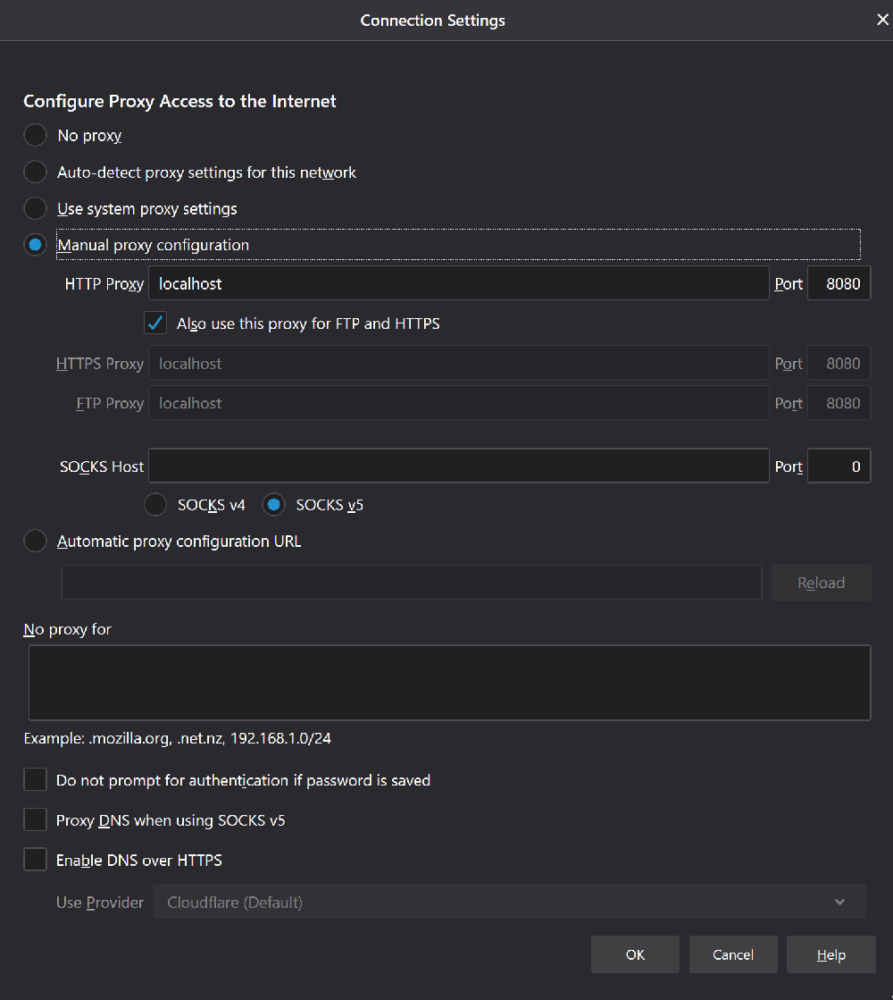
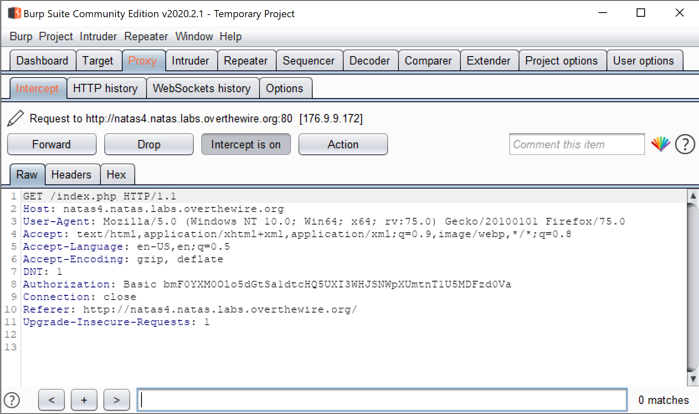

# Burp Suite

[DOWNLOAD LINK](https://portswigger.net/burp)

After installation, run Burp and in the tabs go to Proxy &gt; Options to make sure it is running on the same ip and port.

Then, you need to configure your browser to use the Burp Proxy listener as its HTTP proxy server. To do this, you need to change your browser's proxy settings to use the proxy host address \(by default, 127.0.0.1\) and port \(by default, 8080\) for both HTTP and HTTPS protocols, with no exceptions. The details of how to do this vary by browser and version, but are roughly as follows:

* **Firefox** - Go to the Firefox menu, click on Options, scroll all the way down to find Network Settings. For HTTP Proxy, when it was 127.0.0.1, it did not communicate with Burp for some reason so I changed it to "localhost".   
* **Chrome/IE** - The Chrome browser picks up the HTTP proxy settings configured on the host computer. If you are using Chrome, you can open your computer's built-in browser and follow the instructions for configuring that. If you aren't sure where the built-in proxy settings are, open Chrome, go to the Customize menu, select Settings, click on "Show advanced settings", and click the "Change proxy settings ..." button. This will open the relevant configuration options for your host computer.
* **Safari** - Go the Safari menu, click on Preferences, click on Advanced, and by the Proxies label click the "Change Settings" button. This will open the Network configuration settings for your current network adapter. In the Proxies tab, check the "Web Proxy \(HTTP\)" box, and enter your Burp Proxy listener address in the "Web Proxy Server" field \(by default, 127.0.0.1\), and your Burp Proxy listener port in the \(unlabeled\) port field \(by default, 8080\). Ensure the "Bypass proxy settings for these Hosts & Domains" box is empty. Repeat these steps for the "Secure Web Proxy \(HTTPS\)" checkbox. Click "OK" and "Apply" and close the open dialogs.

Now go to any website in that browser and see Burp capture packets.

